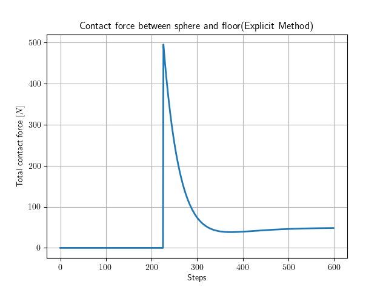
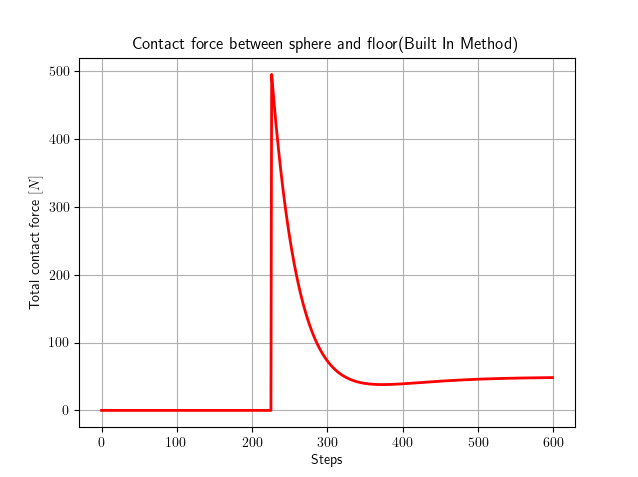
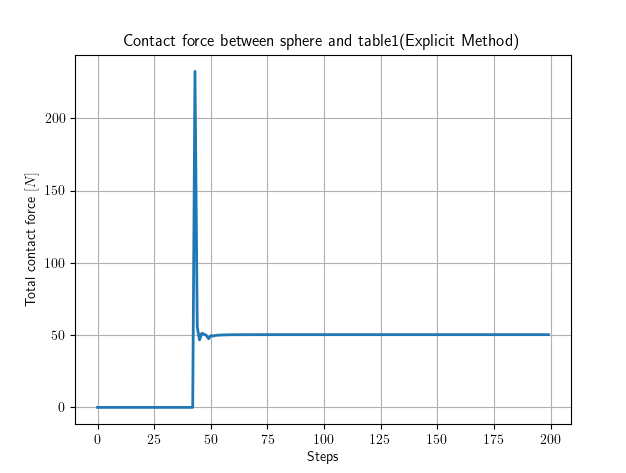
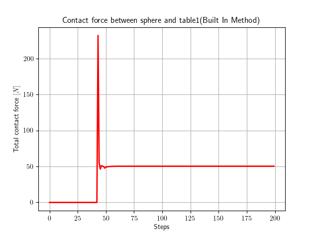

# mujoco_validation

Retrieve the contact info and forces happened during a simulation between each pair of bodies in contact and validate the built-in method that computes the contact forces.
This method is validated in two different situations, as shown in the demos. These are based on the functions contained in the src folder.

## Folders list

| Folder                                                                       | Contents                                      |
| :------------------------------------------------------------------------- | :------------------------------------------------- |
| [demos](./demos) | Contain the examples of different environments in which the cumulative contact forces between pair of bodies are validated and the information (penetration, velocity of deformation of the contact etc.) are extracted from the simulation. |
| [media](./doc/media) | Contain the images produced by the demos.|
| [output](./output) | Contain the .csv files, in which, step by step, the contact information are stored. |
| [src](./src) | Contain the utilities functions that allow the demo to work. |

## Demos

### Demo #1 - Sphere-plane simulation

#### Simulation description

This demo consists in a sphere falling on a plane and resting on it. The aim of this simulation is to compare the forces retrieved by the _mujoco_validation_ module utilities, which exploit a reconstructed MuJoCo explicit model to calculate them, and compare the results with the built-in functions results, which are instead based on solving a convex optimization problem. Moreover, all the contact info at the current time step, such as penetration and velocity of deformation of each contact point, are appended to a .csv file.
All the parameters of the simulation, like stiffness of the contact, mass of the sphere etc. are visible inside the XML model in the demo code.

#### How to launch it

Clone the repository (if not done previously) and inside the main folder execute the following commands to source the environment and launch the demo:

```sh
roscd; cd ../src/
cd environment_identification
source set_env.sh
cd mujoco_validation/demos
python3 demo_sphere_plane_simulation.py
```

#### Expected output

The simulation will output two figures showing the contact force history during the simulation, calculated with the explicit method and the built-in one. Moreover, the results for the contact info are stored in the _contact_data_simulation.csv_ file in the current working directory.
For the default simulator parameters the output images will look like:

Explicit Method             |  Built-in Method
:-------------------------:|:-------------------------:
  |  

### Demo #2 - Robot-plane simulation

#### Simulation description

This simulation consists in an environment composed of a Franka Emika Panda robot, with attached at the end-effector a sphere, coming in contact with a fixed plane. The robot is controlled via a hybrid force/motion controller that activates the force control when in proximity of the table. It tries to stabilize the force between the two bodies at $50$ $N$. As the previous simulation, all the infos about the forces acting in the contacts are plotted and stored, with all the other contact info at current step, in a .csv file.

#### How to launch it

Clone the repository (if not done previously) and inside the main folder execute the following commands to source the environment and launch the demo:

```sh
roscd; cd ../src/
cd environment_identification
source set_env.sh
cd mujoco_validation/demos
python3 demo_panda_sphere_simulation.py
```

#### Expected output

The simulation will show the robot coming in contact and stabiling it, then the figures of the forces are plotted and all the info stored in the _contact_data_simulation.csv_ file in the current working directory. The two output figures in case of default simulation parameters will look something similar to the ones shown below.

Explicit Method             |  Built-in Method
:-------------------------:|:-------------------------:
  |  
